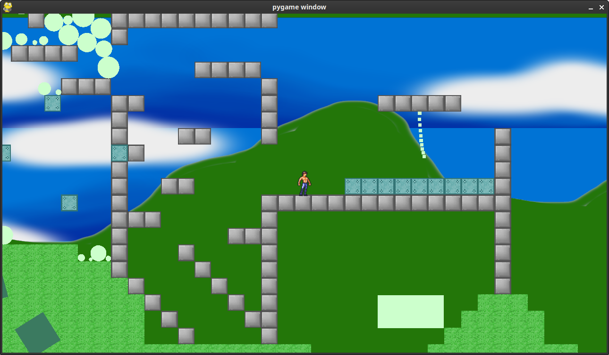

## Python Jump'n'Run - *The Nth attempt* 

It seems to be pretty hard hijacking a physics engine for having good player control. 
However, the rest is just industriousness. 
Boy! What weird, psychedelic games i could produce nowadays, given some months time or so (haha).

This is a continuation of efforts from ["thegame"](https://github.com/defgsus/thegame).
The graphics rendering is done with [moderngl](https://github.com/moderngl/moderngl),
matrix transformations via numpy thanks to [Pyrr](https://github.com/adamlwgriffiths/Pyrr)
and physics by [pymunk](https://github.com/viblo/pymunk). 
Window management with [pygame](https://github.com/pygame/pygame).

Also shout outs to the people at [opengameart.org](https://opengameart.org/) 
and all creative beings in general.

